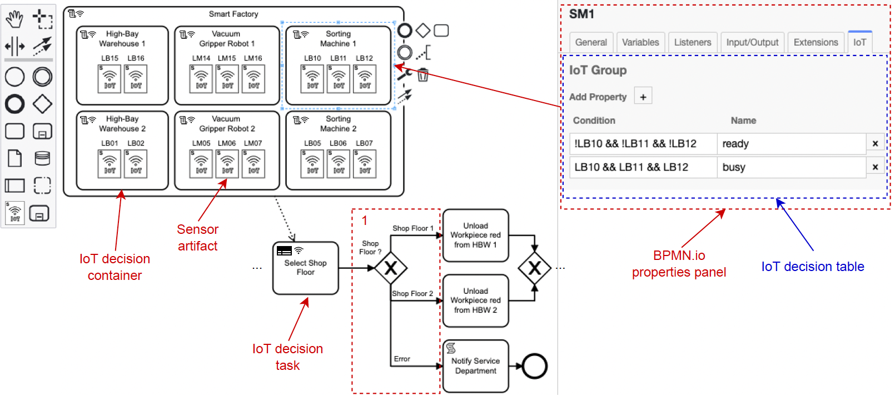

# BPMDS Decision Framework

## About
This project creates a BPMDS Decision Framework with a modeler based on bpmn.io that extends the BPMN 2.0 notation and contains an IoT-driven execution engine.




## Run the Framework

You need a [NodeJS](http://nodejs.org) development stack with [npm](https://npmjs.org) installed to build the project.

To install all project dependencies execute

```sh
npm install
```

To start the example execute

```sh
npm start
```
> Modeler is now accessible on **127.0.0.1:5555**

[Optional] To build the example into the `public` folder execute

```sh
npm run all
```


## License

MIT
